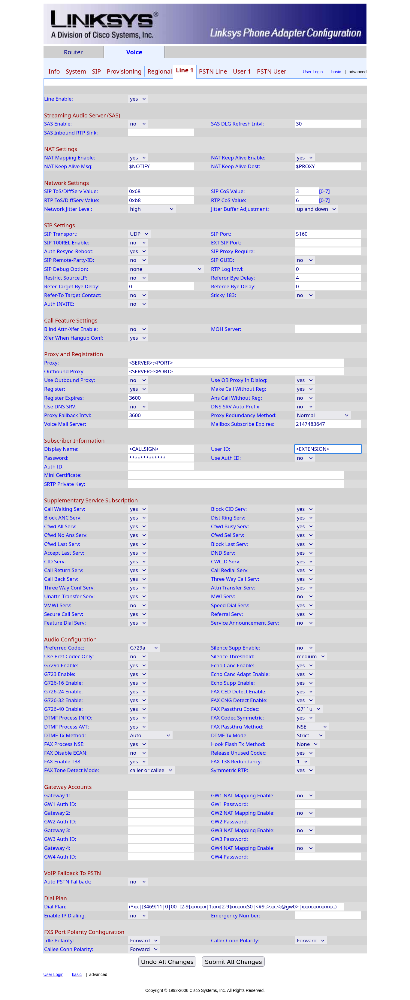

# Linksys SPA-3102

The Linksys SPA 3102 is an ATA allowing the user to use a POTS phone to access a
VoIP service.

## Configuration

Go to the ATA's admin page. The default URL is `http://sipuraspa/admin`,
but you may have to replace `sipuraspa` with the IP address that the device
obtained from your router in your network.

1. Choose “Admin Login”, then enable the “advanced” mode (both top right)
2. In the “Voice” section, choose the “Line 1” subsection
3. Set the following parameters:

3.1 NAT Settings
* **NAT Mapping Enable**: Yes
* **NAT Keep Alive Enable**: Yes

3.2 SIP Settings
* **SIP Port**: 5160

3.3 Proxy and Registration
* **Proxy**: This will be the domain name sent in your credentials email (ex: `pbx-us1.hamsoverip.com:5160`)
* **Outbound Proxy**: Same
* **Register Expires**: 3600
* **Use DNS SRV**: No
* **DNS SRV Auto Prefix**: No

3.4 Subscriber Information
* **Display Name**: Enter your Callsign and name.
* **User ID**: Enter your Extension from the credentials email.
* **Password**: Enter your password from the credentials email.
* **Use Auth ID**: No

!!! note "Last updated 2025-10-26 Olivier VK7SHM"
