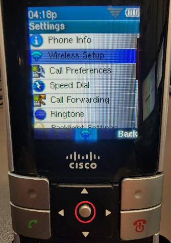
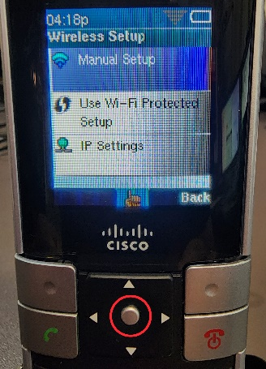
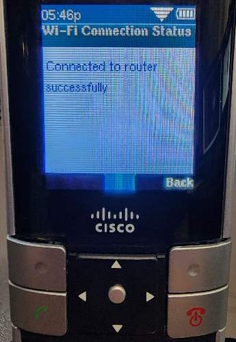
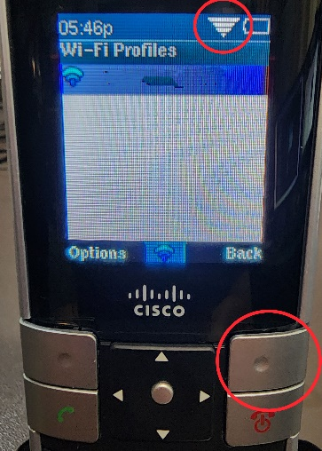
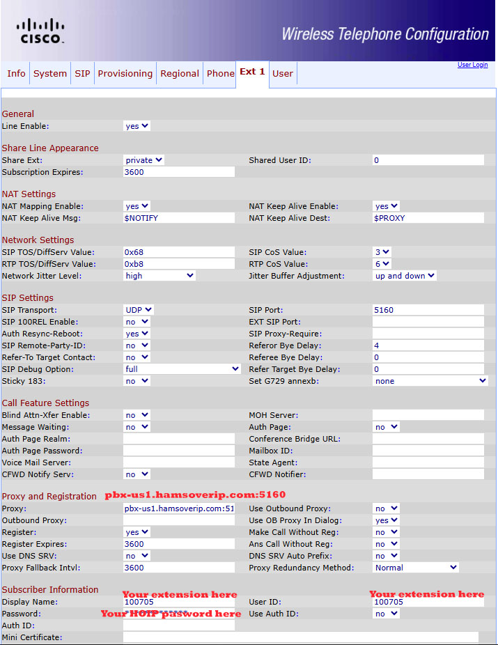

# Configure Cisco WIP 310 for HOIP

The Cisco WIP 310 is a cordless SIP (Session Initiation Protocol) phone designed for business use on a Wi-Fi network. It operates on the 2.4-GHz band, supporting the 802.11b/g standard. The phone features a 1.8-inch color LCD, and its security protocols include WEP, WPA, and WPA2.

## Connecting the phone to your home WIFI network

1. Press the “Select” button on your phones keypad.

    

2. The Settings screen should appear. Press the “Select” button again.

    

3. Use the “Down Arrow” key and select the Wireless Setup option and press the “Select” button.

    

4. Select the “Manual Setup” option and press the “Select” button.

    

5. Next press the “Options” button.

    

6. Use the Down Arrow to highlight the “Scan Networks” option and press the “Select” button.

    

7. Use the Arrow key to highlight the wireless network you wish to connect to and press the “Select” button.

    

8. Once the phone has connected to your wireless network you will receive the message “Connected to router successfully”.

    

9. Within a few seconds and you should see your network SSID displayed along with a bar graph showing the signal strength of the connection. Next, press the “Back” button a few times to return to the home screen.

    

10. From the home screen, press the “Select” button twice.

    

11. The follow screen should appear. With the Phone Info option highlighted, press the “Select” button.

    

12. Note the IP address assigned to the phone. You will need it for the next step.

    

## Configuring the phone to connect to HOIP

1. Open a Browser window on your computer and in to URL line and type your phone’s IP address. The following screen should appear. Click on the “Admin Login” option in the upper righthand corner.

    

2. Under the **Ext 1** Tab your settings should look like this:

    
    

    !!! tip "Heads up"

        You need to enter the details as shown in the email containing your HOIP credentials.  
        In particular, the Proxy will be different if you've been provisioned on the EU or AP servers.

    Remember to submit your changes.

3. Under the **Phone** tab, your settings should look like this:

    

    Remember to submit your changes.

**At this point your phone should be working!**

---

!!! note "Written by Brad N8PC, last updated 2025-08-07"
