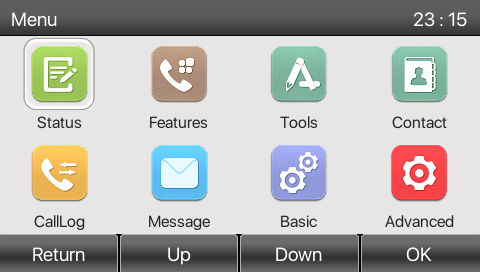
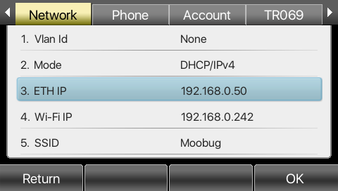
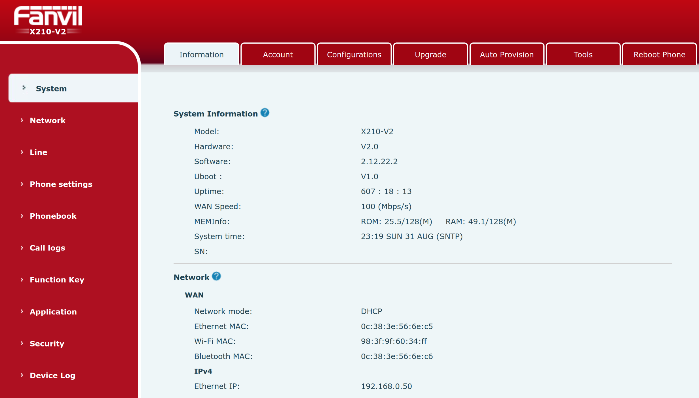
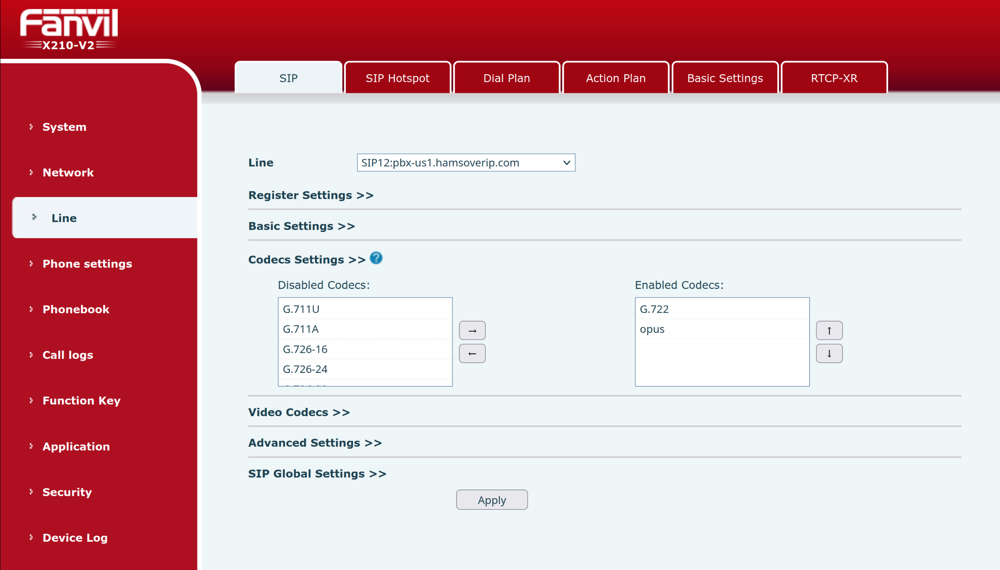

# Configure Fanvil X210/X210-V2 for HOIP

The Fanvil X210 and X210-V2 is a high-end enterprise IP phone designed for executives and busy professionals who handle a large volume of calls. It has a modern, elegant design with a large 4.3-inch main color display and two additional 3.5-inch side color displays for up to 106 DSS keys, which can be configured for functions like speed dialing and group broadcasting. The phone provides high-definition audio on both the speakerphone and handset, with support for the Opus codec for a rich, low-frequency sound. It also features built-in Bluetooth and Wi-Fi connectivity via a USB dongle, allowing for flexible headset and network options. The X210 supports 20 SIP lines, 3- or 6-way audio conferencing, and can receive video calls with H.264 video codec support, making it a versatile tool for unified communications. It is compatible with major platforms like 3CX, Asterisk, and Broadsoft, and includes dual Gigabit ports with integrated PoE.

??? info "Here's a table of the differences between the features between the X210 and X210-V2"

    | Feature             | Fanvil X210 (V1)                                  | Fanvil X210-V2                                                              |
    | ------------------- | :-----------------------------------------------: | :-------------------------------------------------------------------------: |
    | Audio Conference    | 3-way local conference                            | 6-way local conference                                                      |
    | Bluetooth           | Built-in Bluetooth 2.1                            | Built-in Bluetooth 4.2                                                      |
    | Video Codec         | H.264 support                                     | H.264 & 1080P support                                                       |
    | 3CX Support         | Standard functionality                            | Supports the Router Phone feature for 3CX remote sites                      |
    | Speakerphone Audio  | HD Audio                                          | HD Audio with Opus codec support and a larger audio cavity for richer sound |
    | Connectivity        | Wi-Fi connectivity via USB dongle (requires WF20) | Wi-Fi connectivity via USB dongle (requires WF20)                           |
    | Overall Performance | Runs on an older chipset                          | Runs on a new, more powerful chipset for improved performance               |

This phone also provides a web based interface to configure the features of the phone.

## Obtain the IP Address of the Phone

After connecting the phone to the network and letting it boot, you can then obtain the IP Address of the phone.

* Press the `Menu` button
* Use the arrow keys to navigate to the Status icon.
  
* Press OK
* The IP address will be available to you under 3. ETH IP or 4. Wi-Fi IP, depending on how you've connected your phone to your network.
  

## Log into the Web Interface

* Open a web browser on another computer that is also on the same network as the phone
* Browse to `http://x.x.x.x/`, where `x.x.x.x` is the IP address you found in the previous section.
* You'll need to enter the username and password for the admin user.
* You'll then be in the System Information screen.
  

## Configure your Extension for HOIP

* Click on the **Line** tab on the left hand side of the web interface.
* From the main part of the interface, select a **Line** that isn't already in use, I've chosen SIP12 because reasons.
* In the **Register Settings** section, set the following fields:

    * **Username**: This is the extension number from the credentials email
    * **Display Name**: Set this to your extension number also
    * **Realm**: Set this to the server name as provided in your credentials email: e.g. `pbx-us1.hamsoverip.com` - do not include the port number on the end
    * **Active**: checked
    * **Authentication User**: Set this to your extension number also
    * **Authentication Password**: This is the password from the credentials email
    * **Server Name**: Set this to the server name, the same as **Realm**

    * **Server Address**: Set this to the server name, the same as **Realm**
    * **Server Port**: `5160`
    * **Transport Protocol**: `UDP`
    * **Registration Expiration**: `3600`
      

* Under **Codecs Settings**, set the following:

    * Make sure that G.722 is at the top of the **Enabled Codecs** list on the right hand side
      

* Leave all other fields in this section as per their defaults.  Click [Apply].
* Once the page reloads (which will only be a couple of seconds), make sure that **Line Status** is Registered.

## Configure your Side (DSS) Key

* Click on the **Function Key** tab on the left
* Click on the **Side Key** tab at the top
* Choose a **Key** that isn't already in use.  I've chosen F7 because reasons.
* For your chosen **Key**, set the following fields:

    * **Type**: Line
    * **Name**: Choose a name that will appear on the screen next to your Side Key of choice.
    * **Line**: Select the Line you configured earlier.  In my example, it was SIP12.
    * **Icon Color**: Default Green (I've not worked out how to Custom yet!)
      

* Click [Apply], and the Side Key on your phone should now show your new extension!

!!! note "Written by Dave M7TLB, last updated 2025-08-31"
