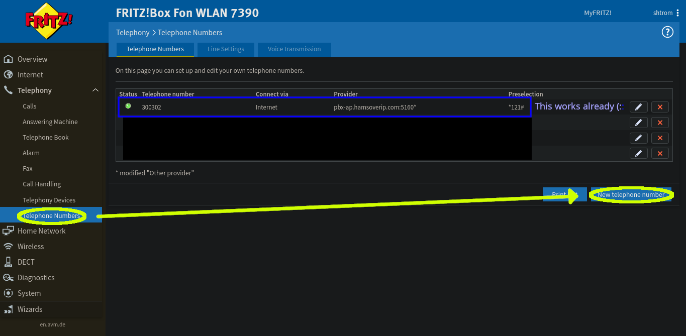
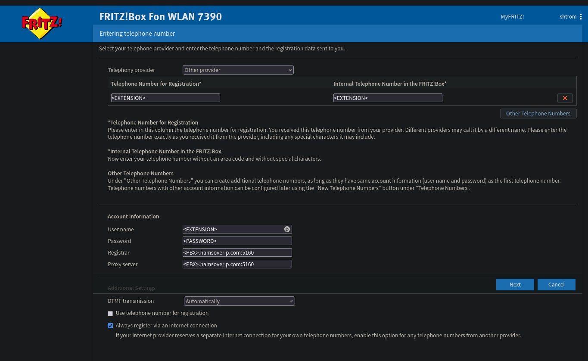

# FRITZ!Box 7390

The [FRITZ!Box WLAN
7390](assets.avm.de/files/docs/fritzbox/fritzbox-7390/fritzbox-7390_man_en_GB.pdf)
is a (EoL) router with [built-in telephony
support](http://service.avm.de/help/en/FRITZ-Box-7390-avme/016/hilfe_fon_anrufliste).

Configuring a HoIP account in its PBX allows you to then use any other telephony
device (POTS, DECT, SIP phones, ...) to use and react to it, with a Preselection
prefix if desired.

## Configuration

1. From the main admin page (generally at http://fritz.box), open the
   “Telephony” menu in the left sidebar, then select “Telephone numbers”.
2. In the telephone  numbers page, choose the “New telephone number” button at
   the bottom right of the list.

3. Fill out the form as follows

3.1 Set the “Telephony Provider” dropdown to “Other provider”; If you want to
later add additional HoIP extensions, you can select the existing provider
instead.

3.2 Set the “Telephone Number for Registration” and “User name” to your
Username/Extension from the registration email. You may also want to set
“Internal Telephone Number in the FRITZ!Box” to the same value.

3.3 Set the “Password” to the Password from the email.

3.4 Set the “Registrar” and “Proxy server” to `<SERVER>:<PORT>`

4. If all goes well, the next page will test the connection and succeed.

5. Back to the Telephony admin page, you can see the green light next to the
   account, confirming that it's functional. You can also use the pen icon to
   edit a few more parameters for the account, but nothing that should be required
   for it to work.

!!! note "Last updated 2025-10-26 Olivier VK7SHM"
