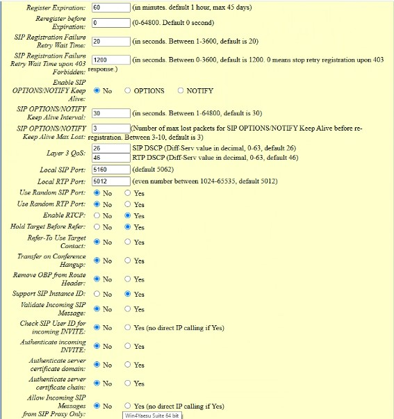

# Grandstream HT802 v2 ATA

The [Grandstream HT802 v2](https://www.grandstream.com/products/gateways-and-atas/analog-telephone-adaptors/product/ht802v2) is a compact 2-port analog telephone adapter (ATA) that allows users to create a high-quality and manageable IP telephony solution for residential and office environments.  It supports 2 SIP profiles through 2 FXS ports and a single 10/100Mbps port.

## Setting up the ATA for the HOIP network

We've included screenshots from the HT802's web interface below, but the key pertinent fields are mentioned here:

* **Account Active**: Yes
* **Primary SIP Server**: _the Server provided in your provisioning email: e.g. `pbx-us1.hamsoverip.com:5160`_
* **Prefer Primary SIP Server**: Yes
* **Outbound Proxy**: _the Server provided in your provisioning email: e.g. `pbx-us1.hamsoverip.com:5160`_
* **Prefer Primary Outbound Proxy**: Yes
* **SIP Transport**: UDP
* **SIP URL Scheme When Using TLS**: sip
* **SIP User ID**: _the Username/Extension provided in your provisioning email: e.g. `102263`_
* **Authenticate ID**: _the Username/Extension provided in your provisioning email: e.g. `102263`_
* **Authenticate Password**: _the Password provided in your provisioning email_
* **Name**: _can be anything you like_
* **SIP Registration**: Yes

See the below screenshots for more settings and values.  Most of these values will be as per the defaults, however this is from a known working configuration, so it's worth double-checking all of the settings just to make sure.

## Screenshots

**1 of 5**

**2 of 5**

**3 of 5**

**4 of 5**

**5 of 5**

!!! note "Last updated 2025-07-27 by Brad N8PC"
