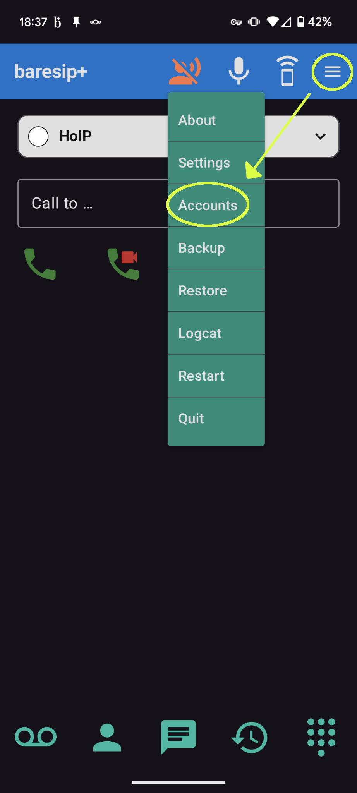
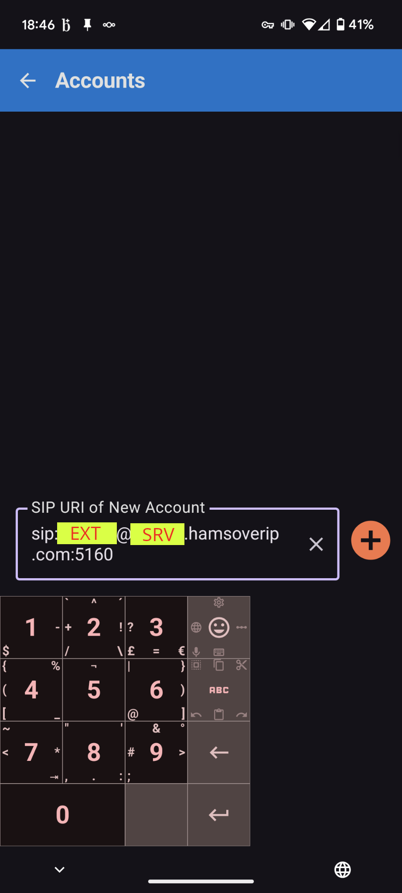
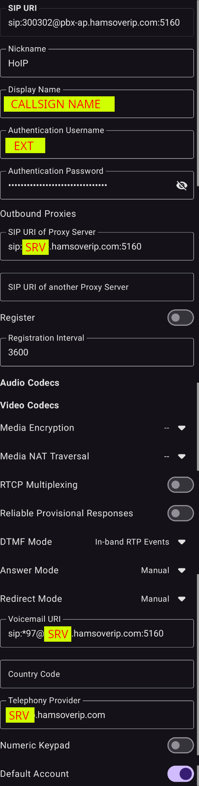

# baresip 

baresip is a simple SIP client for Android. It is [Open Source](https://github.com/juha-h/baresip-studio) and available
from the [F-Droid Free Software store](https://f-droid.org/packages/com.tutpro.baresip/).

## Configuration

1. Tap the hamburger button on the top right, and choose “Accounts”

{ height="50%" width="50%" }

2. On the Accounts screen, add the SIP URI of the account. It will be of the
   form `sip:<EXTENSION>@<SERVER>:<PORT>`, from the response email to your
   extension request.

{ height="50%" width="50%" }

3. In the account details

3.1 Use a recognisable nickname for the account, e.g., “HoIP”; this is only for
    you

3.2 Set the display name to a friendly string, e.g., `<CALLSIGN> <FIRST NAME>`

3.3 Set the “Athentication Username” to the <EXTENSION> from the email.

3.4 Set the “SIP URI of Proxy Server” to `sip:<SERVER>:<PORT>`.

3.5 Set the “Registration interval” to 3600

3.6 Set the “Voicemail URI” to `sip:*97`; baresip will append the server details
automatically on save.

3.7 The “Telephony Provider” should already be set to `<SERVER>`

3.8. You may want to toggle the “Numeric Keypad” and “Default Account”

{ height="50%" width="50%" }

!!! note "Last updated 2025-10-26 Olivier VK7SHM"
