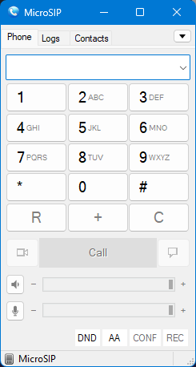
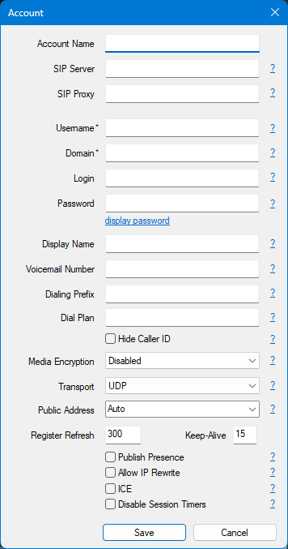
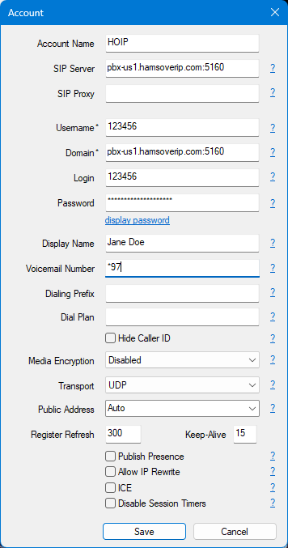
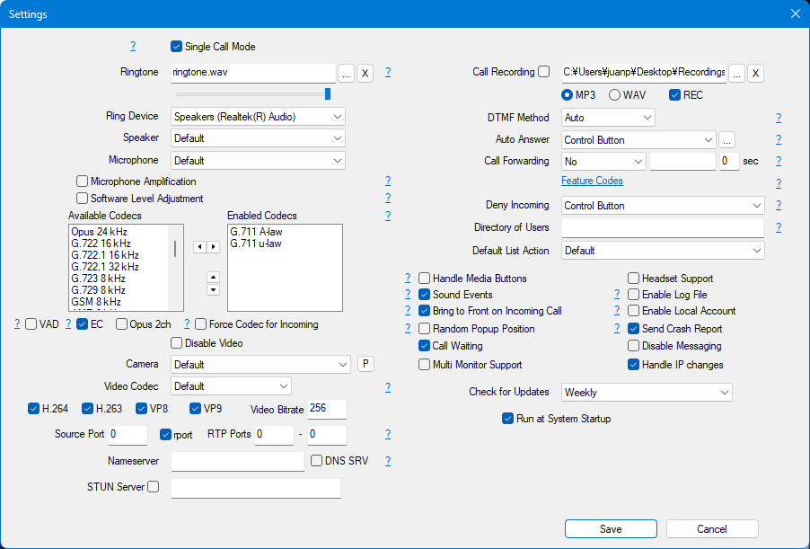

# Configuring MicroSIP

## About MicroSIP

MicroSIP ([microsip.org](https://www.microsip.org)) is an open source and portable SIP softphone for Windows. It is also compatible with Linux and MacOS by using Wine.

It uses a very small footprint and memory usage, making it really convenient for ham radio shack computers that are being used for multitasking with other tools.

## Usage Instructions

1. Download MicroSIP, either the Install version or the ZIP portable version from [microsip.org/downloads](https://www.microsip.org/downloads).
    * Note: There is a regular and a lite version. The only difference between them is that the regular version supports SIP Video (which HOIP doesn't support, but other SIP services support)

2. Install MicroSIP or decompress the portable ZIP file to a convenient location.
3. Run it by finding MicroSIP or running the EXE file.
4. By default, the softphone just starts up, without any accounts added.

    

5. Click the *Down arrow button* atop the MicroSIP window, and select the **Add account...** menu option. A new window will appear.

    { height="50%" width="50%" }

6. Insert the following information:

    * **Account Name:** An identifier name for your HOIP SIP account. This is helpful if you use multiple SIP accounts with MicroSIP.
    * **SIP Server:** Copy and paste the SIP server you received in your welcome email. If you are copying and pasting it from the email, delete the http:// prefix and the / suffix after pasting. Don't forget to include the port.
    * **SIP Proxy:** Leave it *blank*.
    * **Username:** Your extension in your credentials email.
    * **Domain:** Copy the same as you put in SIP Server.
    * **Login:** Optional, however, recommended to paste your Username here.
    * **Password:** The password you received in your credentials email.
    * **Display Name:** This can be anything that allows the other HOIP users to identify your account.
    * **Voicemail Number:** Insert `*97`, which is HOIP's voicemail number.
    * **The rest of the form can be safely left as is**

One you click on the Save button, MicroSIP will go back to the main menu, attempt the connection to HOIP's SIP server, and validate your credentials and configurations.

If any configuration is missing or your password is wrong, it will let you know about it.

### Example account configuration

## Dialing

Click or type the number you want to call in the main window. Press the Call button.

## Volume Controls

There are two sliders in the bottom section of the MicroSIP window. These are volume sliders for the audio out (speakers or headphones) and audio in ( microphone.)

## Calling Voice Mail

Click on the Voice Mail button in the lower right corner of the MicroSIP window. It will dial the configured Voice Mail number.

## Set Do Not Disturb

The Do Not Disturb function will allow you to force MicroSIP to be silent, not playing any ringtone or showing any notification in your computer desktop. It also marks your account as Busy. Press the DND button in the bottom of the MicroSIP window to toggle DND mode on or off.

When toggled on, the button appears with a color background, and the status bar at the bottom will show *Do Not Disturb*.

## Set Auto Answer

If you want MicroSIP to immediately pick up your phone calls, you can activate the AA (Auto Answer) option from the bottom of the MicroSIP window.

## Advanced Settings

By clicking the *Down arrow button* in the main MicroSIP window, and clicking the **Settings** option, you can configure more options, including selecting a proper ringtone, what sound device to use for the Ringtone, or the actual call, among many many other options, including Call Recording.

You can actually stop MicroSIP from autostarting automatically when you login to your computer from this window.

For safety sake, we recommend not to change any of these options, except Ringtone, Ring Device, Speaker and Microphone.

!!! note "Written by Juan HK4H, last updated 2026-09-02 Jesse WH8AV"
